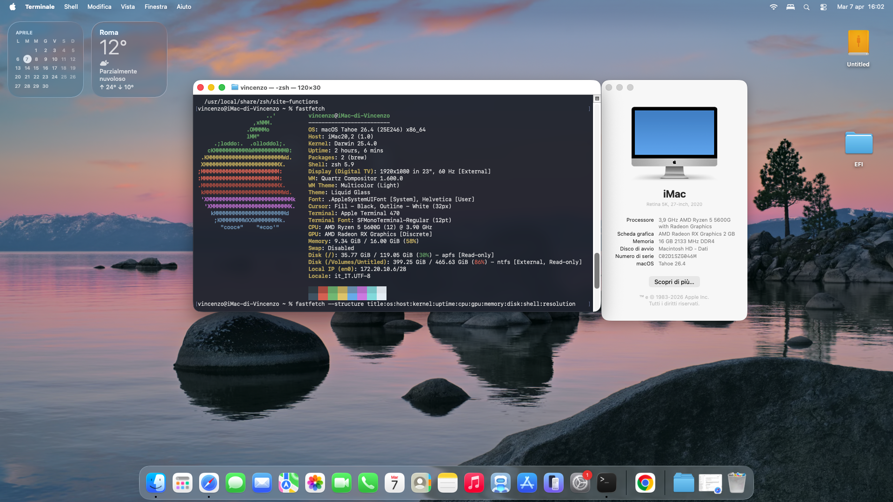

# Ryzen-5-5600G-MSI-B550-Hackintosh-OpenCore
OpenCore EFI for AMD Ryzen 5 5600G on MSI B550, configured for macOS Tahoe.
# OpenCore EFI – Ryzen 5 5600G / MSI B550 (macOS Tahoe)

This repository contains my OpenCore EFI for a Hackintosh build based on **AMD Ryzen 5 5600G** and **MSI B550 motherboard**, configured for **macOS Tahoe**.

After 6 days of testing, reading Dortania many times, fixing errors, and learning step by step with only basic knowledge, I finally managed to get the system working.  
This is also a small personal achievement for me, and I'm sharing it in case it helps someone with a similar setup.

---

## Important Notice

This EFI is shared **for educational purposes only**.  
It may work on hardware similar to mine, but **it is not guaranteed to work on your machine** without changes.

Please:

- Generate your own **SMBIOS**
- Remove and replace all personal data
- Check BIOS settings
- Verify your hardware compatibility
- Read the Dortania guide before using this EFI

I am **not responsible** for boot issues, data loss, or anything caused by improper use.

---

## My Hardware

- **CPU:** AMD Ryzen 5 5600G  
- **GPU:** Integrated Radeon Graphics (5600G iGPU)  
- **Motherboard:** MSI B550 Gaming series  
- **RAM:** 16 GB  
- **Storage:** SSD / NVMe  

---

## macOS Version

Tested with:

- **macOS Tahoe**

---

## Bootloader

- **OpenCore 1,0,7**

---

## Included Kexts

The EFI currently uses these kexts:

- RyzenCPUPowerManagement
- AMFIPass
- AppleALC
- Lilu
- NootedRed
- NameFix
- VirtualSMC
- WhateverGreen

> Kext list may change over time depending on updates and hardware adjustments.

---

## What Works

- Booting macOS  
- Graphics acceleration (configured setup)  
- Audio  
- USB  
- General daily usage  

---

## What May Require Extra Work

- iServices  
- Sleep / wake  
- DRM  
- Full hardware-specific optimization  

---

## BIOS Notes

Settings may vary depending on the exact MSI B550 model, but in general make sure to check:

- Above 4G Decoding  
- UEFI boot mode  
- Secure Boot disabled  
- CSM disabled  
- SATA mode properly configured  
- XHCI Hand-off enabled if needed  

---

## Before Using This EFI

Please do the following first:

1. Replace **PlatformInfo / SMBIOS** with your own values  
2. Check **Serial Number**, **MLB**, **ROM**, and all identifiers  
3. Verify USB mapping if needed  
4. Check ACPI and BIOS configuration  
5. Make a backup of your current EFI  
6. Read the official Dortania guide  

---

## Clean Up Personal Data Before Sharing / Using

If you are downloading or adapting this EFI, always make sure these values are unique and personal to your own system:

- Serial Number  
- MLB  
- SystemUUID  
- ROM  

Never use someone else's SMBIOS values on your own machine.

---

## Based On

This setup was built by heavily relying on the official Dortania OpenCore documentation.

---

## Credits

Huge thanks to:

- Dortania  
- Acidanthera  
- The Hackintosh community  
- GitHub and Reddit users who share knowledge and troubleshooting  

---

## Final Notes

This is not a “universal EFI”.  
It is simply the EFI that helped **my own build** boot and work.

If it helps someone with a similar configuration, that's great.

If you use it, study it first and adapt it properly instead of copying blindly.

---

## Screenshots

You can add screenshots here later:

- OpenCore picker  
- macOS desktop  
- About This Mac  
- System Information  
- Fastfetch output  

---

## Repository Structure

```text
EFI
└── OC
    ├── ACPI
    ├── Drivers
    ├── Kexts
    ├── Resources
    ├── Tools
    └── config.plist
